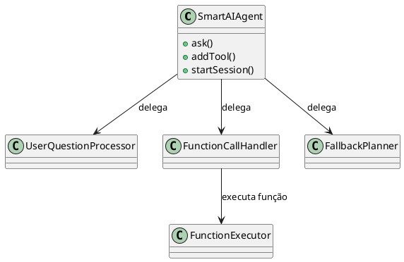

# �🎓 AI Learning Journey: De Workflows a Agents

Este projeto é uma **jornada de aprendizado sobre IA** que demonstra a evolução natural de simples workflows para agents inteligentes com function calling usando Google Gemini.

## 🎯 Propósito do Projeto

A ideia deste projeto é fornecer uma **jornada de aprendizado progressivo sobre IA**, começando com workflows simples e evoluindo para agentes autônomos. Você aprenderá:

1. **Workflows** - Fluxos lineares e previsíveis
2. **Agents** - Sistemas autônomos que tomam decisões

## 📚 Jornada de Aprendizado

### 📋 Fase 1: Workflows (Básico)
- **O que são**: Fluxos lineares Input → Processamento → Output
- **Características**: Previsíveis, diretos, sem memória
- **Localização**: `examples/workflows/`

### 🤖 Fase 2: Agents (Avançado)
- **O que são**: Sistemas que decidem, lembram e adaptam
- **Características**: Autônomos, com memória, múltiplas ferramentas
- **Localização**: `examples/agents/` e `src/`

## 📁 Estrutura do Projeto

```
ai-learning-journey/
├── src/                         # Código principal dos agents
│   ├── agents/
│   │   └── SmartAIAgent.js      # Classe principal do agente IA
│   ├── utils/
│   │   └── ChatTerminal.js      # Interface de chat simplificada para terminal
│   ├── providers/
│   │   └── LogDataProvider.js   # Provedor de dados mock
│   └── config/
│       └── functions.js         # Definição das funções disponíveis
├── examples/                    # Exemplos educacionais
│   ├── workflows/               # Fase 1: Workflows simples
│   │   ├── workflow_frontend.html
│   │   └── workflow_backend.js
│   ├── agents/                  # Fase 2: Agents autônomos
│   └── demo.js                  # Demonstração completa
├── .env.example                 # Exemplo de variáveis de ambiente
├── .gitignore
├── package.json
├── index.js                     # Ponto de entrada principal
└── README.md                    # Este arquivo
```

## 🚀 Configuração e Execução

### 1. **Pré-requisitos**
- Node.js (versão 16 ou superior)
- API Key do Google Gemini

### 2. **Obter API Key do Google**
1. Acesse o [Google AI Studio](https://makersuite.google.com/app/apikey)
2. Crie uma nova API key
3. Copie a chave gerada

### 3. **Instalação**

```bash
# Clone ou baixe o projeto
cd ai-learning-journey

# Instale as dependências
npm install

# Configure a API key
cp .env.example .env
# Edite o arquivo .env e coloque sua API key
```

### 4. **Configurar Variáveis de Ambiente**

Edite o arquivo `.env`:
```env
GOOGLE_API_KEY=sua_api_key_do_google_aqui
```

### 5. **Executar**

```bash
# Executar demonstração
npm start

# ou
npm run demo
```

---

## 📋 FASE 1: Workflows (Fluxos de Trabalho)

Workflows são o ponto de partida ideal para entender IA - são **fluxos lineares e previsíveis**.

### 🔄 O que são Workflows?

**Workflows** são fluxos lineares ou ramificados onde cada passo é executado em uma ordem específica:

```
Input → Processamento → Output
```

### 📁 Arquivos em `examples/workflows/`

#### `workflow_frontend.html`
- **Tipo**: Workflow client-side
- **Fluxo**: 
  1. Usuário insere API key na interface
  2. Usuário clica em "Analisar Logs"
  3. Frontend faz requisição para Gemini API
  4. API processa e retorna análise
  5. Resultado é exibido na própria página HTML
- **🔒 Segurança**: API key inserida pelo usuário (não hardcoded)
- **📱 Interface**: Resultado mostrado na página (não no console)

#### `workflow_backend.js`
- **Tipo**: Workflow server-side
- **Fluxo**:
  1. Script carrega API key do arquivo .env
  2. Define logs predefinidos
  3. Monta prompt para análise
  4. Envia para Gemini API
  5. Imprime resultado no terminal
- **🔒 Segurança**: Usa variável de ambiente GOOGLE_API_KEY

### 🔄 Características dos Workflows:

✅ **Previsíveis**: Sempre seguem a mesma sequência
✅ **Diretos**: Input → Processamento → Output
✅ **Simples**: Fáceis de entender e debugar
✅ **Rápidos**: Execução linear sem decisões complexas

### 🤖 Vs. Agents (Agentes):

| Workflow | Agent |
|----------|-------|
| Sequência fixa | Toma decisões |
| Sem memória entre execuções | Mantém contexto |
| Uma tarefa por vez | Múltiplas capacidades |
| Processamento direto | Raciocínio e planejamento |

### 🚀 Como executar Workflows:

#### Frontend Workflow:
```bash
# Abra o arquivo no navegador
open examples/workflows/workflow_frontend.html
# ou
firefox examples/workflows/workflow_frontend.html
```
**📋 Instruções:**
1. Obtenha sua API key em [Google AI Studio](https://makersuite.google.com/app/apikey)
2. Cole a API key no campo na página
3. Clique em "Analisar Logs"
4. Veja o resultado exibido na própria página

#### Backend Workflow:
```bash
# Certifique-se de que o arquivo .env está configurado na raiz do projeto
cd ../../  # Voltar para raiz do projeto
cat .env    # Verificar se GOOGLE_API_KEY está definida

# Execute com Node.js
cd examples/workflows/
node workflow_backend.js
```

### 🔒 Segurança Implementada:

✅ **Backend**: Usa variável de ambiente do arquivo `.env`
✅ **Frontend**: Usuario insere API key manualmente (não exposta no código)
✅ **Validação**: Verifica formato da API key antes de usar

---

## 🤖 FASE 2: Agents (Agentes Autônomos)

Agents representam o próximo nível - sistemas que **decidem, lembram e adaptam**.

### 🧠 O que são Agents?

**Agents** são sistemas inteligentes que podem:
- **Decidir** qual ação tomar baseado no contexto
- **Manter memória** entre interações
- **Usar ferramentas** diferentes conforme necessário
- **Adaptar** seu comportamento

### 🔧 Anatomia de um Agent

#### 1. 🧠 **MEMÓRIA/CONTEXTO**
```javascript
this.conversationHistory = [];  // Lembra interações passadas
this.userPreferences = {};      // Aprende preferências do usuário
```

**Por que importante?**
- Permite continuidade entre conversas
- Agent pode referenciar informações anteriores
- Melhora respostas com base no histórico

#### 2. 🤔 **TOMADA DE DECISÃO**
```javascript
async decideAction(userInput) {
    // Analisa entrada do usuário
    // Decide qual ferramenta usar
    // Retorna ação escolhida
}
```

**Como funciona?**
- Agent analisa o que o usuário quer
- Compara com ferramentas disponíveis
- Escolhe a melhor opção automaticamente

#### 3. 🛠️ **FERRAMENTAS (Tools)**
```javascript
this.tools = {
    analyzeText: this.analyzeText.bind(this),
    calculateMath: this.calculateMath.bind(this),
    searchInfo: this.searchInfo.bind(this),
    summarizeConversation: this.summarizeConversation.bind(this)
};
```

**Ferramentas disponíveis:**
- **analyzeText**: Analisa sentimento e tópicos em texto
- **calculateMath**: Faz cálculos matemáticos
- **searchInfo**: Busca informações gerais
- **summarizeConversation**: Resume a conversa atual

#### 4. 🔄 **LOOP PRINCIPAL**
```javascript
async processInput(userInput) {
    // 1. Adicionar à memória
    // 2. Decidir qual ferramenta usar
    // 3. Executar ferramenta
    // 4. Salvar resultado na memória
}
```

### 🆚 Comparação: Workflow vs Agent

| Característica | Workflow | Agent |
|---------------|----------|-------|
| **Decisão** | Sequência fixa | Escolhe ações |
| **Memória** | Não mantém | Lembra contexto |
| **Ferramentas** | Uma função | Múltiplas ferramentas |
| **Adaptação** | Sempre igual | Aprende e adapta |
| **Complexidade** | Simples | Mais complexo |

### 📝 Exemplo de Agent em ação:

```
👤 Usuário: Analise este log: ERROR: Connection timeout after 30s
🤔 Agent decidiu usar: analyzeText
🤖 Agent (usando analyzeText):
Sentimento: Negativo
Tópicos principais: Erro de conexão, timeout
Problemas: Falha de rede após 30 segundos

👤 Usuário: Quanto é 25 * 4 + 10?
🤔 Agent decidiu usar: calculateMath  
🤖 Agent (usando calculateMath):
Resultado: 110
```

---

## 📚 Conceitos Demonstrados no Agent

### ✅ Function Calling Dinâmico
- A IA decide automaticamente quais funções executar
- Execução dinâmica por nome de função (string)
- Fácil adição de novas funções sem modificar o agente

### ✅ Arquitetura Modular
- **SmartAIAgent**: Classe principal que coordena tudo
- **LogDataProvider**: Provedor de dados separado
- **Configurações**: Funções e configurações isoladas

### ✅ Memória de Contexto
- Histórico de conversas mantido automaticamente
- IA lembra de perguntas anteriores
- Suporte a referências contextuais

### ✅ Segurança
- API keys em variáveis de ambiente
- Arquivo .gitignore configurado
- Exemplo de configuração fornecido

## 🛠️ Componentes Principais do Agent

### SmartAIAgent (`src/agents/SmartAIAgent.js`)
O agente foi projetado com **arquitetura modular**, separando responsabilidades em serviços especializados:
- `FunctionExecutor`: executa funções dinamicamente.
- `FunctionCallHandler`: gerencia o loop de function calling.
- `FallbackPlanner`: executa fallback dinâmico (decomposição via LLM).
- `UserQuestionProcessor`: envia a pergunta inicial para a IA.

O arquivo `SmartAIAgent.js` apenas orquestra, delegando para esses serviços, facilitando manutenção, testes e evolução.

**Principais métodos:**
- `addTool(functionDeclaration, implementation)` – Adiciona uma função/tool disponível para a IA
- `startSession(systemPrompt)` – Inicia a sessão do agente, aceitando um system prompt opcional
- `ask(question)` – Faz uma pergunta para a IA e executa function calling se necessário

**Transparência e Debug:**
Todos os serviços possuem logs detalhados para facilitar o rastreamento do fluxo de execução e depuração.

### LogDataProvider (`src/providers/LogDataProvider.js`)
Simula um sistema de dados com:
- Logs de sessões de usuários
- Métodos que a IA pode chamar
- Dados mock para demonstração

**Métodos disponíveis:**
- `getLogs(sessionId)` - Busca logs por ID
- `getAvailableSessions()` - Lista sessões disponíveis

### Configurações
- **functions.js**: Define funções disponíveis para a IA (usado como referência, mas agora as funções são registradas diretamente no demo.js via `addTool`)


## 📋 Exemplo de Uso do Agent
### Sobre `addTool` e Prompt Inteligente
O método `addTool` permite registrar funções (tools) que a IA pode chamar durante a conversa. Cada função é descrita por um objeto (nome, descrição, parâmetros) e uma implementação (função JavaScript). Isso torna fácil adicionar novas capacidades ao agente sem alterar sua estrutura interna.

O **prompt do sistema** pode ser customizado para orientar a IA a:
- Processar, filtrar ou resumir dados retornados pelas funções antes de responder ao usuário (ex: filtrar apenas logs de erro).
- Explicar brevemente ao usuário os passos que está realizando (ex: buscar ID, filtrar logs, etc).
- Considerar que “primeira sessão” significa o menor ID retornado por `getAvailableSessions`.

Exemplo de trecho de prompt:
```
Se necessário, você pode processar, filtrar ou resumir os dados retornados pelas funções antes de responder ao usuário. Por exemplo, se a função retornar uma lista de logs, você pode filtrar apenas os logs que contenham a palavra "erro" ou fazer um resumo.

Ao responder, explique brevemente ao usuário os passos que está realizando, como buscar o ID da sessão, filtrar logs, etc, antes de apresentar o resultado final.

Considere que "primeira sessão" significa a sessão com o menor ID retornado pela função getAvailableSessions. Sempre que o usuário pedir pela primeira sessão, utilize o menor ID disponível.
```

### Exemplo
```javascript
const SmartAIAgent = require("./src/agents/SmartAIAgent");
const LogDataProvider = require("./src/providers/LogDataProvider");
const agent = new SmartAIAgent(process.env.GOOGLE_API_KEY);
const logProvider = new LogDataProvider();

// Adiciona funções/tools disponíveis
agent.addTool({
  name: "getLogs",
  description: "Busca logs de uma sessão específica pelo ID da sessão",
  parameters: {
    type: "object",
    properties: { sessionId: { type: "integer" } },
    required: ["sessionId"]
  }
}, ({ sessionId }) => logProvider.getLogs(sessionId));

agent.addTool({
  name: "getAvailableSessions",
  description: "Lista todas as sessões disponíveis no sistema",
  parameters: { type: "object", properties: {} }
}, () => logProvider.getAvailableSessions());

// Inicia a sessão (opcional: system prompt)
await agent.startSession("Você é um assistente educacional de IA.");

// Faz perguntas normalmente
const resposta = await agent.ask("Quais sessões estão disponíveis?");
console.log(resposta);
```
## 💬 ChatTerminal (`src/agents/ChatTerminal.js`)
Classe utilitária para interação de chat no terminal, agora simplificada e localizada em `src/utils/ChatTerminal.js`:

**Principais métodos:**
- `input()` – Lê a entrada do usuário (prompt "User: ")
- `output(message)` – Exibe a resposta da IA (prefixo "AI:")

Exemplo de uso:
```javascript
const ChatTerminal = require("./src/utils/ChatTerminal");
const terminal = new ChatTerminal();
terminal.output("Olá!");
const userInput = await terminal.input();
terminal.output(`Você digitou: ${userInput}`);
```
## 🖥️ Exemplo de chat contínuo (demo.js)

Veja `examples/agents/demo.js` para um exemplo de chat contínuo, onde o usuário pode conversar livremente com o agente e as funções são registradas via `addTool`. O exemplo já utiliza o novo caminho de importação:

```javascript
const ChatTerminal = require("../../src/utils/ChatTerminal");
```

Fluxo básico:
1. Cria o agente e registra as funções com `addTool`
2. Inicia a sessão com `startSession`
3. Usa o `ChatTerminal` para interação
4. Loop de chat: lê input do usuário, envia para o agente, exibe resposta

### Uso Avançado
```javascript
// Testando diferentes modelos
const agentFlash = new SmartAIAgent(
  config.API_KEY, 
  provider, 
  functions, 
  "gemini-1.5-flash"
);

const agentPro = new SmartAIAgent(
  config.API_KEY, 
  provider, 
  functions, 
  "gemini-1.5-pro"
);
```

## 🎯 Fluxo de Funcionamento do Agent

1. **Pergunta**: Usuário faz uma pergunta em linguagem natural
2. **Análise**: IA analisa e decide se precisa executar funções
3. **Execução**: Sistema executa dinamicamente a função solicitada
4. **Resposta**: IA processa o resultado e gera resposta final

```
Usuário → SmartAIAgent → Gemini → Function Call → LogDataProvider → Resultado → Resposta
```

## 🔧 Adicionando Novas Funções ao Agent

### 1. **No Data Provider:**
```javascript
// src/providers/LogDataProvider.js
getServerStatus() {
  return "Server is running normally";
}
```

### 2. **Na Configuração:**
```javascript
// src/config/functions.js
{
  name: "getServerStatus",
  description: "Check server status",
  parameters: { type: "object", properties: {} }
}
```

### 3. **Pronto!** O agente já pode usar a nova função automaticamente.

---

## 🎓 Progressão de Estudos Recomendada

### 📚 **Nível Iniciante**
1. Comece com **workflows** (`examples/workflows/`)
2. Entenda o fluxo Input → Processamento → Output
3. Execute os exemplos frontend e backend

### 📚 **Nível Intermediário**
4. Estude a estrutura de **agents** (`examples/agents/`)
5. Entenda memória, decisão e ferramentas
6. Execute o agent simples

### 📚 **Nível Avançado**
7. Analise o **SmartAIAgent** completo (`src/`)
8. Entenda function calling dinâmico
9. Modifique e adicione novas funções

### 🎯 **Próximos Níveis de Estudo:**
- **Multi-Agent Systems**: Múltiplos agents trabalhando juntos
- **Learning Agents**: Agents que melhoram com o tempo
- **Tool-Using Agents**: Agents que podem usar APIs externas
- **Planning Agents**: Agents que fazem planos complexos

---

## 📈 Vantagens da Arquitetura

1. **🔧 Modular**: Cada componente tem responsabilidade única
2. **🔄 Flexível**: Fácil trocar modelos de IA ou providers
3. **📈 Extensível**: Adicionar novas funções sem modificar o agente
4. **🧪 Testável**: Componentes podem ser testados isoladamente
5. **📚 Educativo**: Código bem documentado para aprendizado
6. **🔒 Seguro**: API keys protegidas em variáveis de ambiente

## 🚨 Segurança

- ✅ API keys em arquivo `.env` (não commitado)
- ✅ Arquivo `.env.example` para orientação
- ✅ `.gitignore` configurado
- ✅ Validação de API key obrigatória

## 📝 Scripts Disponíveis

```bash
npm start        # Executa a demonstração
npm run demo     # Alias para npm start
```

## 🐛 Troubleshooting

### Erro: "GOOGLE_API_KEY não encontrada"
1. Verifique se o arquivo `.env` existe
2. Confirme que a variável está definida: `GOOGLE_API_KEY=sua_chave`
3. Restart o terminal/aplicação

### Erro de dependências
```bash
npm install
```

### Problemas com a API
- Verifique se a API key é válida
- Confirme que o Google AI está habilitado

## 📚 Recursos para Aprender Mais

- [Google AI Documentation](https://ai.google.dev/)
- [Function Calling Guide](https://ai.google.dev/docs/function_calling)
- [Node.js Best Practices](https://github.com/goldbergyoni/nodebestpractices)

---

## 💡 Dicas de Estudo

### 🎯 **Para Workflows:**
- Workflows são ótimos para começar a entender IA
- Têm fluxo claro e previsível
- Perfeitos para tarefas específicas e lineares

### 🎯 **Para Agents:**
- Agents são mais complexos e incluem tomada de decisão autônoma
- Comece entendendo workflows primeiro
- Depois estude agents simples
- Experimente modificar as ferramentas
- Observe como o agent "decide" qual usar

### 🎯 **Características importantes de Agents:**
- **Autonomia**: Toma decisões sozinho
- **Reatividade**: Responde ao ambiente
- **Proatividade**: Pode iniciar ações
- **Adaptabilidade**: Aprende com experiência

---

**Desenvolvido para fins educacionais - Jornada de aprendizado de IA: Workflows → Agents** 🎓

---

## Diagrama simples da arquitetura do SmartAIAgent (PlantUML)


